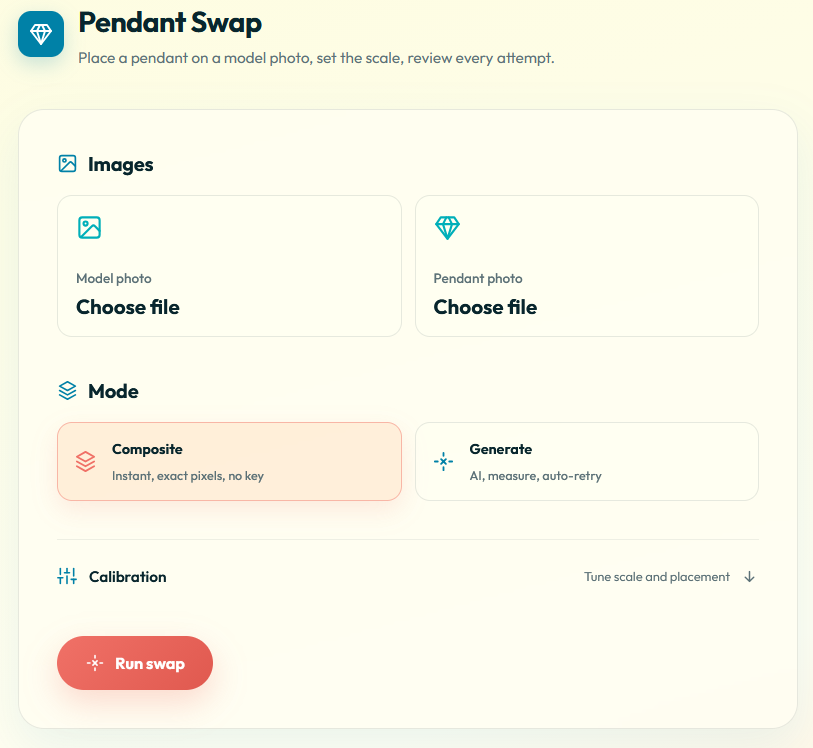
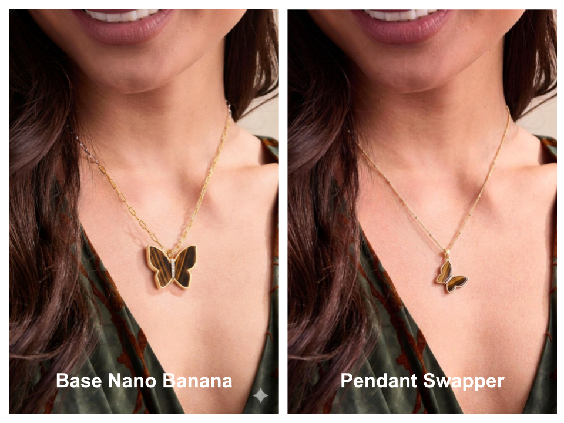
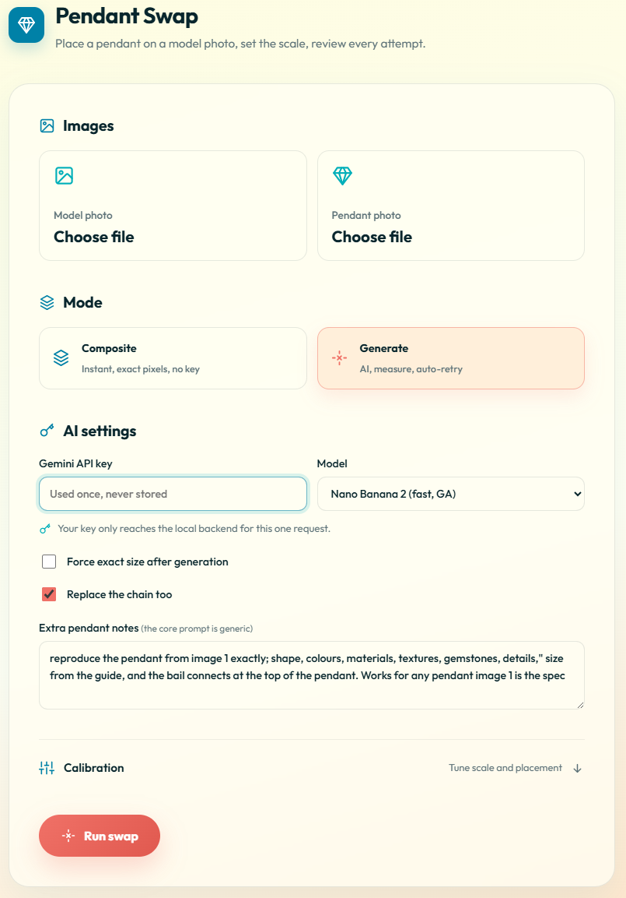
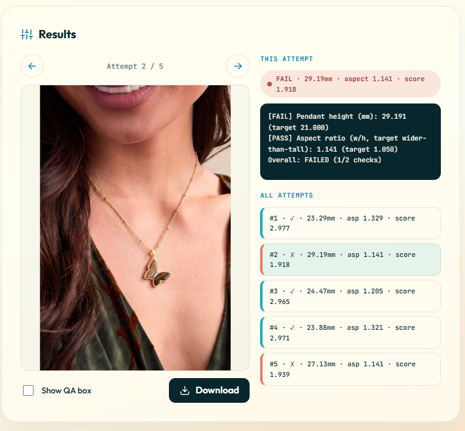

# Pendant Swap

Put a jewelry pendant onto a model photo at the correct real-world size, with an automatic quality check.

Pendant Swap takes a model photo and a pendant photo, removes the pendant from its background, places it on the model with the right scale, then measures the result and retries until the size is correct. It can also repaint the chain to match the pendant. You bring your own Gemini API key.



## Why use this instead of plain Gemini

Asking Gemini to "add this pendant" in one shot has three problems:

1. **Wrong size.** Gemini draws the pendant at whatever size it likes, usually far too large.
2. **Wrong detail.** It reinvents the stone pattern, the metal trim, and the bail.
3. **No quality check.** You get one image with no measurement and no second try.

Pendant Swap fixes all three: it hands the model a clean cutout of the exact pendant, biases the size toward your target, then **measures the result in millimeters** and generates several attempts so you can pick the best. An optional size-lock step rescales the pendant to an exact size.



## Quick start

```bash
python -m venv .venv
# Windows:
.venv\Scripts\activate
# macOS or Linux:
source .venv/bin/activate

pip install -r requirements.txt
```

Requires Python 3.10 or newer. Start the local server:

```bash
python -m uvicorn api:app --reload
```

When you see `Application startup complete`, open the app in your browser:

```
http://127.0.0.1:8000/web/index.html
```

### Get a Gemini API key

The generate step uses Google's Gemini image model. To get a free key:

1. Go to [Google AI Studio](https://aistudio.google.com/apikey) and sign in with a Google account.
2. Click **Create API key**.
3. Copy the key and paste it into the API key box in the app (or set `GEMINI_API_KEY` for the CLI).

Your key is used only for your own requests and is never stored, logged, or committed.

## Using the app

1. **Add two images.** Pick a model photo and a pendant photo. Each box highlights once a file is chosen.
2. **Choose Generate mode.** Composite is an instant rough placement with no AI. Generate uses the AI and runs the measure-and-retry loop. Paste your API key in the AI settings area that appears.
3. **Set options.** Turn on "Replace the chain too" if your pendant photo shows the chain you want. Turn on "Force exact size" only if you need a precise millimeter match.
4. **Run.** Press Run swap. Generate creates several attempts and measures each one.



5. **Review.** Flip through attempts with the arrows, read the PASS or FAIL measurement on the right, and download your favorite. Turn on "Show QA box" to see exactly what was measured.



If a result comes out too big, open Calibration, lower the Target size, and run again. The default calibration values (`ref_px` 169, `ref_mm` 21) are tuned for the included sample photos.

## How it works

```
            +------------------+
            |     Web UI       |   static HTML/JS, posts to /swap
            +---------+--------+
                      |
            +---------v--------+
            |  FastAPI backend |   thin wrapper; passes the key through, never stores it
            +---------+--------+
                      |
            +---------v--------+
            |   Core engine    |   pure Python (prep, generate, qa, size-lock)
            +------------------+
                      ^
            +---------+--------+
            |       CLI        |   same engine, command line
            +------------------+
```

The pipeline wraps the unreliable AI step in deterministic bookends:

1. **Prep.** Remove the pendant background, isolate the pendant from any attached chain, and build a faint size guide on the model photo.
2. **Generate.** Send the cutout, the model photo, and the guide to Gemini. The guide is drawn smaller than the target because the model tends to oversize the pendant, which biases the result toward the right size. Several independent attempts are produced.
3. **Measure.** Segment the pendant in each result and report its height in millimeters and its shape ratio, with a PASS or FAIL.
4. **Size-lock (optional).** Rescale the AI's own rendered pendant to the exact target size and report the locked measurement.

## Command line

The same engine is available from the terminal:

```
pendant-swap generate  --model M --pendant P --target-mm 21 --ref-px 169 --ref-mm 21 [--max-retries 4] --api-key KEY --out DIR
pendant-swap composite --model M --pendant P --target-mm 21 --ref-px 169 --ref-mm 21 [--x --y --rotate] --out DIR
pendant-swap qa        --result R --target-mm 21 --ref-px 169 --ref-mm 21 --search X0 Y0 X1 Y1 [--annotate]
pendant-swap finish    --image I [--remove-watermark X0 Y0 X1 Y1] [--crop T R B L] [--upscale 2] --out DIR
```

Run `pendant-swap <command> --help` for the full option list. The API key for the CLI can also come from `GEMINI_API_KEY` in your environment or a `.env` file (copy `.env.example` to `.env`). `.env` is gitignored.

## Quality report

| Check | What it measures | Pass condition |
|---|---|---|
| Pendant height (mm) | Segmented pendant height converted to millimeters | Within 20% of the target |
| Aspect ratio | Width divided by height of the segmented pendant | Within 0.30 of the target shape |

## Security

- The API key is never hardcoded, stored, logged, or committed.
- The server never writes the key to disk or returns it in a response.
- `.env` and `samples/` are gitignored.
- Generation errors surface as clear messages, never raw tracebacks.

## Tests

```bash
python -m pytest -q
```
